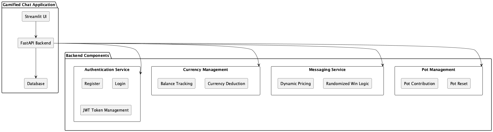
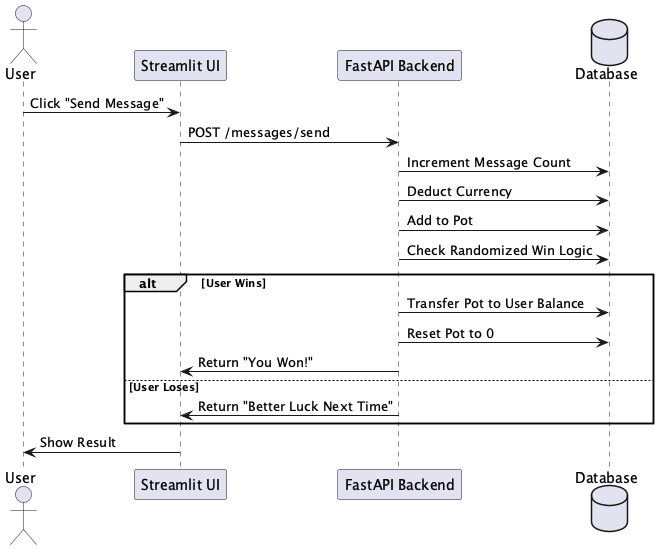
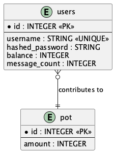
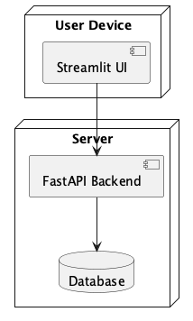

# Gamified Chat Application

A gamified chat application where users interact with a chatbot. Users send messages with dynamic pricing, contribute to a centralized pot, and have a randomized chance to win the pot. 
This project is designed with a modular architecture, employing **FastAPI** for the backend, **Streamlit** for the frontend, and a relational database for persistence.

## Project overview (TOC)
1. [Overview](#overview)
2. [Folder Structure](#folder-structure)
3. [Tech Stack](#tech-stack)
4. [Streamlit UI User Guide](#streamlit-ui-user-guide)

## Overview

### Features
- **Authentication**: Users can register and log in using JWT-based authentication.
- **Dynamic Pricing**: The cost of sending messages increases incrementally based on the user's message count.
- **Pot System**: Contributions are added to a centralized pot with a randomized chance of winning.
- **Streamlit UI**: A user-friendly frontend for interacting with the system.
- **Database Schema**: Relational database design with tables for users and the pot.

### Use Cases
- Gamified interactions for entertainment or education.
- Demonstrates a modular approach to designing interactive web applications.
- Provides a template for building backend-driven applications with dynamic logic.

---

## Folder Structure

### Project Root
The root directory contains essential configuration files, documentation, and scripts for running and deploying the project.

```plaintext
.
├── Procfile                   # Specifies commands for deployment platforms (e.g., Heroku).
├── README.md                  # Project documentation with an overview, usage, and architecture details.
├── alembic.ini                # Alembic configuration file for managing database migrations.
├── docker-compose.yaml        # Docker Compose file for containerizing the application.
├── requirements.txt           # Python dependencies for the project.
├── main.py                    # Entry point for the FastAPI backend.
```

### Backend (Core Application Code)
The `app/` directory contains the core backend logic for the application.

```plaintext
├── app
│   ├── __init__.py            # Makes `app` a package.
│   ├── config.py              # Configuration settings (e.g., database URL, secret keys).
│   ├── core                   # Core utilities and helper modules.
│   │   ├── __init__.py
│   │   └── auth.py            # Authentication logic, including password hashing and JWT handling.
│   ├── db                     # Database-related code.
│   │   ├── __init__.py
│   │   ├── crud.py            # CRUD operations for database interactions.
│   │   ├── database.py        # SQLAlchemy engine and session management.
│   │   └── models.py          # SQLAlchemy models defining database schema.
│   ├── routers                # API route handlers.
│   │   ├── __init__.py
│   │   ├── currency.py        # Endpoints for managing user currency.
│   │   ├── messaging.py       # Endpoints for message sending with dynamic pricing.
│   │   ├── pot.py             # Endpoints for pot management (contributions and resets).
│   │   └── user.py            # Endpoints for user registration, login, and profile.
│   └── schemas                # Pydantic schemas for request and response validation.
│       ├── __init__.py
│       └── user.py            # User-related schemas (e.g., login, registration).

```

### Frontend
The `frontend/` directory contains the Streamlit-based user interface for interacting with the application.
    
```plaintext
├── frontend
│   └── app.py                 # Streamlit UI for user registration, login, balance, pot, and messaging.
```    

### Tests
The `tests/` folder contains unit and integration tests for various application components.
```plaintext
├── tests
│   ├── __init__.py            # Makes `tests` a package.
│   ├── test_currency_endpoints.py   # Tests for currency management endpoints.
│   ├── test_messaging_endpoints.py  # Tests for messaging service endpoints.
│   ├── test_pot_endpoints.py        # Tests for pot management endpoints.
│   ├── test_user_endpoints.py       # Tests for user registration and login endpoints.
```

### Deployment
* Procfile: Deployment instructions, often used for platforms like Heroku.
* docker-compose.yaml: Defines services, networks, and volumes for running the application in containers.

## Tech Stack

### Backend
* FastAPI: High-performance Python framework for building APIs.
* SQLAlchemy: ORM for database interactions.
* Alembic: Database migration tool.
* Cockroach DB: Relational database for data persistence.

### Frontend
* Streamlit: Simple and interactive UI framework for Python.

### Tools
* PlantUML: For generating architecture diagrams.
* Pytest: For testing API endpoints and database operations.
* JWT: For authentication and authorization.

### Cloud services
* Railway: For deploying the application to the cloud.
* Vercel: For hosting the Streamlit frontend.

## Streamlit UI User Guide

1. **Register or Login:** Navigate to the sidebar and choose between registering a new account or logging in with an existing one.
2. **View Balance and Pot:** Once logged in, view your current balance and the amount in the centralized pot.
3. **Send a Message:** Click "Send Message" to contribute to the pot and see if you win.
4. **Logout:** Click "Logout" to end your session.


## Architecture (TOC)
1. [Component Diagram](#component-diagram)
2. [Sequence Diagram](#sequence-diagram)
3. [Entity-Relationship Diagram (ERD)](#entity-relationship-diagram-erd)
4. [Deployment Diagram](#deployment-diagram)

---

## Component Diagram

### Description
The component diagram showcases the overall structure of the gamified chat application. It highlights the main components:
- **Streamlit UI**: The frontend user interface where users interact with the system.
- **FastAPI Backend**: The backend responsible for handling API requests, business logic, and database interactions.
- **Database**: The persistent storage for user data and pot information.

### Key Features
- Authentication Service for registration and login.
- Currency Management for tracking user balances and deducting currency.
- Messaging Service for dynamic pricing and randomized win logic.
- Pot Management for handling contributions and resets.

### Diagram


---

## Sequence Diagram

### Description
The sequence diagram describes the flow of events when a user sends a message. It visualizes interactions between the user, the Streamlit UI, the FastAPI backend, and the database.

### Key Features
- The user initiates the action by clicking "Send Message."
- The backend processes the message, updates the database, and determines whether the user wins the pot.
- The result is returned to the user via the UI.

### Diagram


---

## Entity-Relationship Diagram (ERD)

### Description
The ERD provides a detailed view of the database schema. It defines the relationships between tables:
- **Users Table**: Stores user information, such as `id`, `username`, `balance`, and `message_count`.
- **Pot Table**: Tracks the current amount in the centralized pot.

### Key Features
- The `users` table is related to the `pot` table via contributions.
- Supports operations like balance deduction, pot contributions, and pot resets.

### Diagram


---

## Deployment Diagram

### Description
The deployment diagram illustrates the setup of the application in a real-world environment. It shows how the frontend, backend, and database components are deployed and interact.

### Key Features
- The **Streamlit UI** runs on the user’s device and communicates with the backend.
- The **FastAPI Backend** is hosted on a server, handling all API requests and connecting to the database.
- The **Database** is a centralized data store accessible by the backend.

### Diagram


---

## How to run
```bash
pip install -r requirements.txt
uvicorn uvicorn app.main:app --host 0.0.0.0 --port 8000
```

Deployed Railway: https://web-production-65db.up.railway.app/docs

## How to test
```bash
pytest tests/
```

## How to migration
```bash
alembic init alembic
alembic init migrations
alembic revision --autogenerate -m "Initial migration"
alembic upgrade head
```

## How to generate diagram
1. Install [PlantUML](https://plantuml.com/) locally or use an online PlantUML renderer.
2. Save each `.puml` file provided in the `diagrams` directory.
3. Generate the diagrams:
   - **Command-line**:
     ```bash
     java -jar plantuml-1.2024.8.jar filename.puml
     ```
   - **Online Tool**: Copy and paste the code into [PlantUML Online Editor](http://www.plantuml.com/plantuml/uml/).